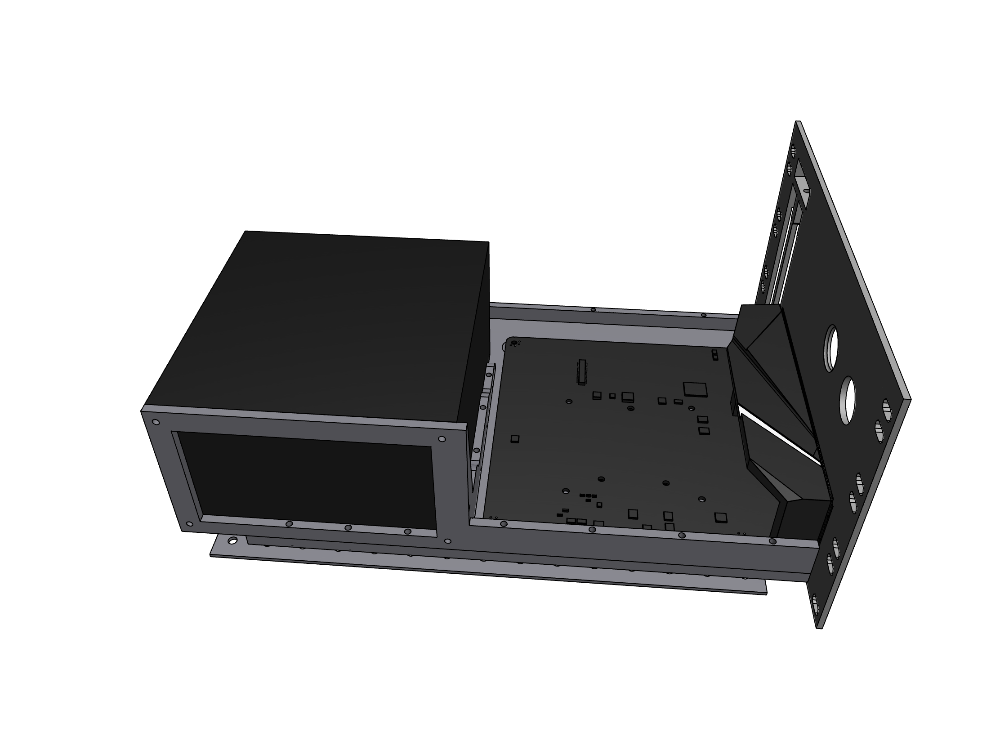

# Custom 10 inch Server Rack
This repository acts as a showcase for the various things I build to get a suitable and working beamer. 
- I build the framework
- Designed the 10 inch racks for my electronics
- And also custom designed a 10 inch rack for mini itx parts

## Table Of Content

- [Pictures](#pictures)
    - [Server](#server)
    - [3D files](#3d-files)
    - [Itx rack pc](#itx-rack-pc)
- [Parts List](#parts-list)
- [See also](#see-also)

## Pictures

### Server

    
    
    

### 3D files

    
    
    
    
    
    
    
    

### Itx rack pc

    
    
    
    
    
    
    
    
    
    
    
    

## Parts List
- [Modem: DrayTek Vigor 165](https://www.amazon.de/-/en/gp/product/B07KM8LH5X/ref=ppx_yo_dt_b_search_asin_title?ie=UTF8&psc=1)
- [Switch: TP-Link TL-SG108PE](https://www.amazon.de/dp/B01BPFKNNM?psc=1&ref=ppx_yo2ov_dt_b_product_details)
- [Server (Router): N5105 4 Core 4 Intel i225 2,5G Nics fanless mini PC](https://de.aliexpress.com/item/1005004340302162.html?spm=a2g0o.order_list.order_list_main.70.21ef5c5fIMJdKi&gatewayAdapt=glo2deu)
- Home Pc: Mac mini
- [Slot Profiles: Alu 20x20mm B-Typ Nut6](https://www.motedis.com/en/Profile-20x20-B-type-slot-6)

## See also
You may also be interested in the following projects:
* [3040 CNC marlin](https://github.com/thob97/3040-CNC-marlin.git)
* [3D Printed Beamer](https://github.com/thob97/3d_printed_beamer.git)https://github.com/thob97/3d_printed_beamer.git
